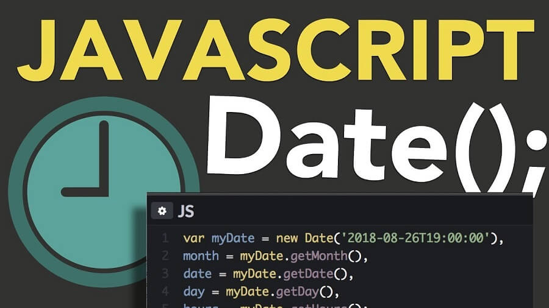
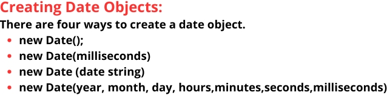
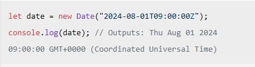
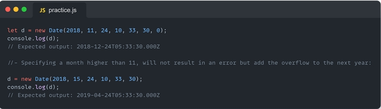
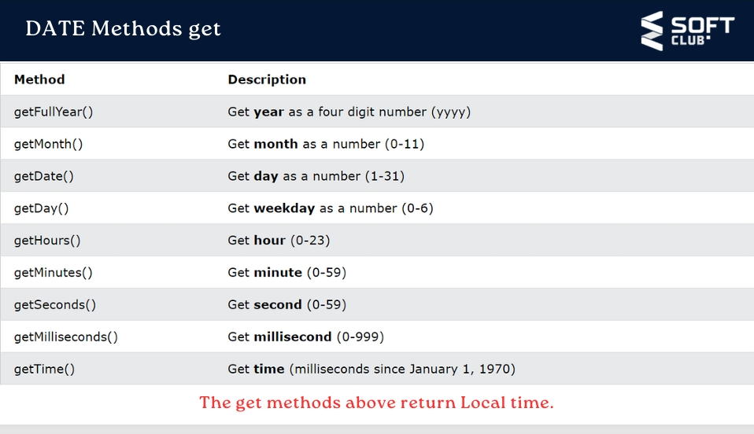
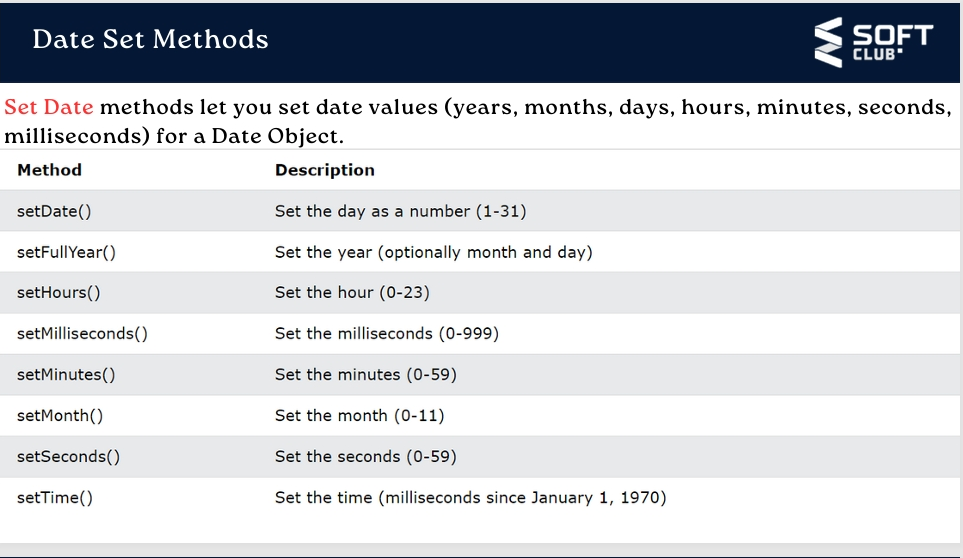
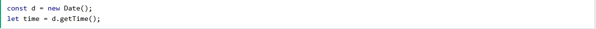

# What is new Date in  JavaScript ? 

### In JavaScript, the new Date() constructor is used to create a new date object. This object represents a single moment in time in a platform-independent format. Here are some ways you can use it:

# CREATING DATE AND TIME
 
#  A JavaScript date is fundamentally specified as the time in milliseconds that has
 # elapsed since the epoch, which is defined as the midnight at the beginning of January
# 1, 1970, UTC (equivalent to the UNIX epoch). This timestamp is timezone-agnostic and
# uniquely defines an instant in history.

###  The Date() constructor creates Date objects. When called as a function, it returns a string
 representing the current time

# whote is new Date()

### Response stopped
### Отправлено пользователем Copilot:
### In JavaScript, new Date() is used to create a new Date object that represents the current ### date and time. This object can be manipulated and used to perform various date and time operations.

`### let currentDate = new Date();`
`### console.log(currentDate); // Outputs the current date and time`

# DATE(string)

### new Date(string)-  creates a date object from a date string

# DATE(year,month,day,...)

###  new Date(year,month,day,hour,minute,second,millisecond) - creates a date object
### with a specified date and time. 7 numbers specify year, month, day, hour, minute,
### second, and millisecond (in that order):JavaScript counts months from 0 to 11:
### January = 0.
### December = 11.

##  The getTime() method returns the number
## of milliseconds since January 1, 1970:

# Date Now

###  Date.now() returns the number of milliseconds
### since January 1, 1970. Date.now() is a static
###  method of the Date object.You cannot use it on a
### date object like myDate.now().
### The syntax is always Date.now().

# Date Methods: getDay, getDate

# Get Date?

###  The getDate() method returns the day
###  of a date as a number (1-31):

### The getDay() method returns the
### weekday of a date as a number
### (0-6).In JavaScript, the first day
### of the week (day 0) is Sunday

# Date Methods: getHours,getMinutes

# GetHours

### The getHours() method returns the hours of
###  a date as a number (0-23):

# Get Minuts

### The getMinutes() method returns the minutes of a
###  date as a number (0-59)

# Date Methods: setFullYear,setMonth

###  The `setFullYear()` method sets the year of a
### date object.The setFullYear() method can
### optionally set month and day:

###  The `setMonth()` method sets the month
### of a date object (0-11): It can also be used
### to set the day of the month
